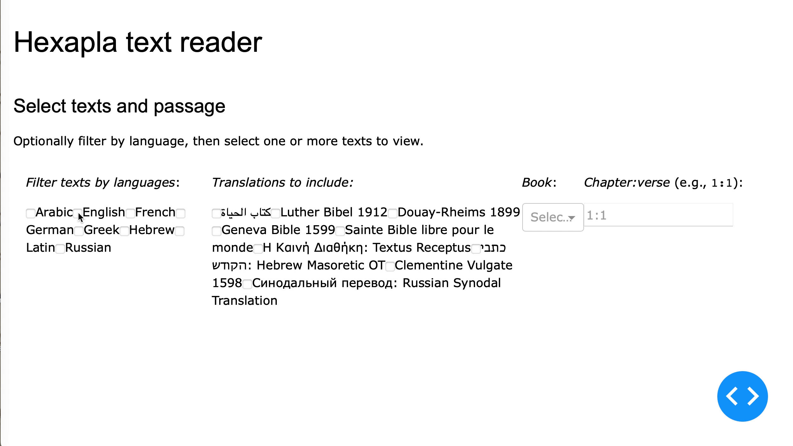

# hexapla

A Julia dashboard for reading aligned displays of multiple biblical translations.  

## Data sources

The `.txt` files in the `data` directory of this repository are openly licensed plain-text translations in the "BibleWorks import (VPL) + SQL" format, downloaded from [https://ebible.org](https://ebible.org/download.php).  For more details including license information about individual files, see the table in `data/sources.cex`.